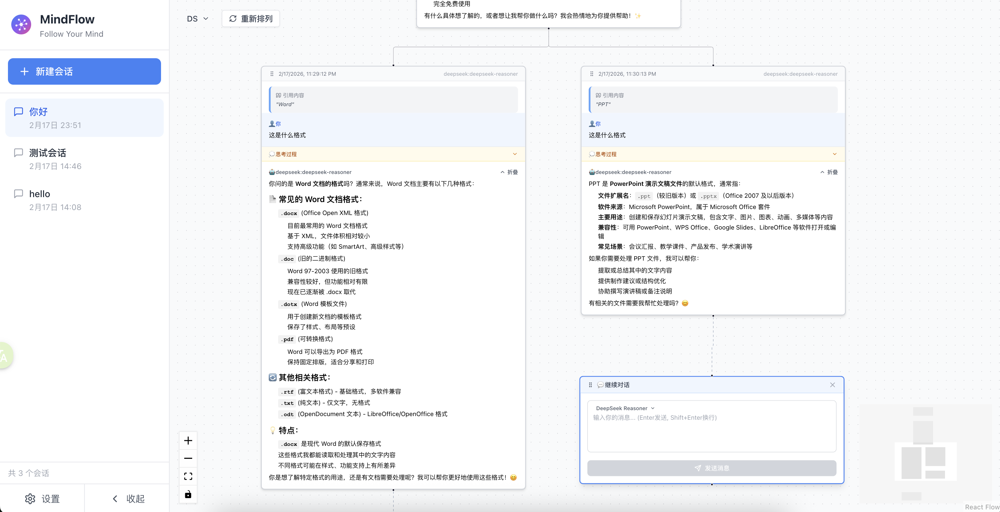

# MindChat - AI思维导图聊天客户端

一个基于React和ReactFlow构建的AI聊天客户端，使用思维导图的形式展示对话分支，支持多模型、多会话管理和智能布局。



## ✨ 功能特性

- 🌳 **思维导图式对话**: 以节点图的形式可视化对话树，清晰展示对话分支
- 🔀 **分支对话**: 从任意节点创建新的对话分支，探索不同的对话路径
- 🤖 **多模型支持**: 支持OpenAI、Anthropic Claude、DeepSeek和自定义API
- 💬 **多会话管理**: 支持创建、切换和管理多个对话会话
- 📝 **引用功能**: 选中任意文本进行引用，AI会基于引用内容回答
- 🧠 **思考过程**: 支持显示AI的思��过程（如Claude的thinking模式）
- 🎯 **智能布局**:
  - 自动避免节点重叠
  - 一键重新排列所有节点
  - 智能计算节点位置
- 📦 **内容折叠**: 长消息支持折叠/展开，保持界面整洁
- 💾 **持久化存储**: 使用IndexedDB本地存储所有会话和配置
- 🎨 **现代化UI**: 基于Tailwind CSS的简洁美观界面

## 🎯 核心功能演示

### 思维导图式对话


### 智能布局与节点管理
- **自动布局**: 智能计算节点位置，避免重叠
- **一键重排**: 点击"重新排列"按钮自动整理所有节点
- **内容折叠**: 超过300字符的消息可以折叠，节省空间


### 引用与分支
- 选中任意文本进行引用
- 从引用内容创建新分支
- 支持多层级对话树


## 技术栈

- React 18 + TypeScript
- ReactFlow (节点图可视化)
- Zustand (状态管理)
- Tailwind CSS (样式)
- Vite (构建工具)

## 快速开始

### 安装依赖

```bash
npm install
# 或
pnpm install
```

### 启动开发服务器

```bash
npm run dev
```

### 构建生产版本

```bash
npm run build
```

## 使用说明

### 1. 配置AI模型
   - 点击左侧边栏的设置图标
   - 添加AI模型配置：
     - **OpenAI**: 输入API密钥和基础URL（可选）
     - **Anthropic**: 输入API密钥
     - **DeepSeek**: 输入API密钥
     - **自定义**: 支持OpenAI、Anthropic或Ollama协议
   - 设置默认模型
   - 每个会话可以单独设置默认模型

### 2. 开始对话
   - 在输入框中输入消息
   - 按 `Enter` 发送（`Shift+Enter` 换行）
   - AI回复会自动添加为子节点
   - 可以在输入框左上角切换模型

### 3. 创建分支
   - 悬停在任意对话节点上，点击底部的 `+` 按钮
   - 或者选中文本后点击"新分支"��钮
   - 从该节点创建新的对话分支

### 4. 引用内容
   - 在任意节点中选中文本
   - 点击弹出的"引用"按钮
   - 在输入框中输入问题，AI会基于引用内容回答

### 5. 管理节点布局
   - **拖动节点**: 按住节点标题栏拖动
   - **重新排列**: 点击左上角的"重新排列"按钮，自动整理所有节点
   - **折叠内容**: 长消息会显示折叠/展开按钮

### 6. 会话管理
   - 左侧边栏显示所有会话
   - 点击会话切换
   - 点击 `+` 创建新会话
   - 右键或长按删除会话

## 项目结构

```
src/
├── components/          # React组件
│   ├── ChatNode/       # 聊天节点组件（支持折叠、引用等）
│   ├── FlowCanvas/     # ReactFlow画布（包含重排按钮）
│   ├── Sidebar/        # 设置侧边栏
│   ├── SessionSidebar/ # 会话管理侧边栏
│   └── MessageInput/   # 消息输入框
├── stores/             # Zustand状态管理
│   ├── chatStore.ts    # 聊天状态和会话管理
│   └── settingsStore.ts # 设置状态
├── services/           # API服务
│   ├── ai.ts           # AI服务集成
│   └── api.ts          # IndexedDB API
├── utils/              # 工具函数
│   └── layoutUtils.ts  # 自动布局算法
├── types/              # TypeScript类型定义
└── App.tsx             # 主应用
```

## 支持的AI模型

### OpenAI
- GPT-4、GPT-4 Turbo、GPT-3.5-turbo等
- 需要OpenAI API密钥
- 支持自定义Base URL（用于代理或兼容服务）

### Anthropic Claude
- Claude 3.5 Sonnet、Claude 3 Opus等
- 需要Anthropic API密钥
- 支持Extended Thinking模式

### DeepSeek
- DeepSeek Chat、DeepSeek Coder等
- 需要DeepSeek API密钥
- 高性价比的国产模型

### 自定义API
- 支持OpenAI协议的API
- 支持Anthropic协议的API
- 支持Ollama本地模型
- 灵活配置Base URL和API密钥

## 🎨 界面特点

- **响应式设计**: 适配不同屏幕尺寸
- **拖拽交互**: 支持节点拖动和画布平移
- **实时更新**: 流式显示AI回复
- **视觉反馈**: 丰富的动画和交互效果
- **暗色主题**: 支持暗色模式（开发中）

## 🔧 高级功能

### 自动布局算法
- 基于树形结构的智能布局
- 自动计算节点间距，避免重叠
- 支持动态调整水平和垂直间距
- 考虑节点实际高度进行精确定位

### 内容折叠
- 超过300字符的消息自动显示折叠按钮
- 折叠后显示前3-5行内容
- 保持界面整洁，提升浏览体验

### 引用系统
- 支持选中任意文本进行引用
- 自动记录引用来源和完整上下文
- AI回答时会考虑引用内容

### 思考过程
- 支持显示AI的思考过程（如Claude的thinking）
- 可折叠/展开查看详细思考
- 思考完成后自动折叠

## 开发计划

详见 [PLAN.md](./PLAN.md)

## 更新日志

### v0.2.0 (2026-02-18)
- ✨ 新增自动布局算法，避免节点重叠
- ✨ 新增一键重新排列功能
- ✨ 新增长消息折叠功能
- 🐛 优化分支节点定位逻辑
- 🐛 改进节点高度估算算法

### v0.1.0
- 🎉 初始版本发布
- ✨ 基础对话功能
- ✨ 多模型支持
- ✨ 会话管理
- ✨ 引用功能

## 贡献指南

欢迎提交Issue和Pull Request！

1. Fork本仓库
2. 创建特性分支 (`git checkout -b feature/AmazingFeature`)
3. 提交更改 (`git commit -m 'Add some AmazingFeature'`)
4. 推送到分支 (`git push origin feature/AmazingFeature`)
5. 开启Pull Request

## License

MIT

## 致谢

- [ReactFlow](https://reactflow.dev/) - 强大的节点图可视化库
- [Zustand](https://github.com/pmndrs/zustand) - 轻量级状态管理
- [Tailwind CSS](https://tailwindcss.com/) - 实用优先的CSS框架
